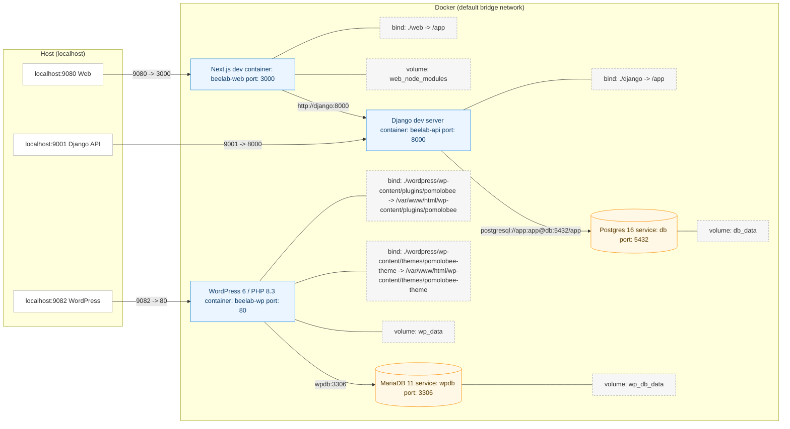
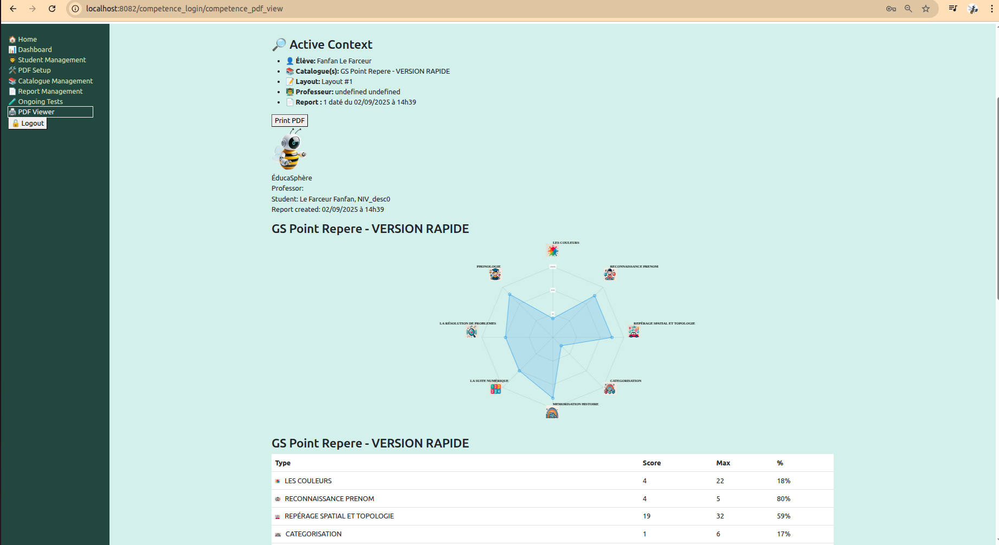

<a href="https://nathabee.github.io/beelab/index.html">
   
</a>

 

# BeeLab: Dockerized Multiservice (Django + Next.js plugins + WordPress + databases)

> [!WARNING]
> **Work in progress** — APIs, docs, and structure may change without notice.
 

BeeLab provides a dockerized multi-service development stack:

* **Django 5** backend (REST API, JWT auth; apps: **UserCore**, **PomoloBeeCore**, **CompetenceCore**)
* **Next.js 14** frontend (calls Django)
* **PostgreSQL 16** for Django
* **WordPress 6 / PHP 8.3 (Apache)** with custom theme and plugins that interface with Django
* **MariaDB 11** for WordPress

Notes:

* “Competence” manages student development charts.
* “PomoloBee” helps farmers manage their orchards.


---

## What is this project?

**beelab** explores a hybrid stack where **WordPress provides the site shell + custom apps (plugins)** while **Django** exposes APIs those apps consume. A separate **Next.js** app exists but is not the focus yet.

Goals:

* Hands-on **Docker Compose** with multiple services and profiles (dev/prod).
* Realistic **WP theme + plugin** development with local builds, WP-CLI, and scripted setup.
* A clean **Django REST** API with JWT auth for WP apps to talk to.
* Repeatable scripts/aliases for day-to-day dev ergonomics.

 
---

## Why this project?

* To **learn Docker** with a realistic, multi-container setup.
* To **build real WP plugins + theme** that talk to a **Python API**.
* To keep a **clean separation of concerns** while iterating quickly.
* It’s a **sandbox**, not a production stack—perfect for experimenting.

---

## TRY ME

This git repository was installed on a VPS, you can access it there:

After installing this repository on nathabee we get:

* WordPress Competence plugin: [https://beelab-wp.nathabee.de/competence](https://beelab-wp.nathabee.de/competence)
* WordPress: [https://beelab-wp.nathabee.de](https://beelab-wp.nathabee.de)
* WordPress admin: [https://beelab-wp.nathabee.de/wp-admin](https://beelab-wp.nathabee.de/wp-admin)
* Django API: [https://beelab-api.nathabee.de/api](https://beelab-api.nathabee.de/api)
* Django Admin: [https://beelab-api.nathabee.de/admin](https://beelab-api.nathabee.de/admin)
* Django API health : [https://beelab-api.nathabee.de/health](https://beelab-api.nathabee.de/health)
* Swagger UI: [https://beelab-api.nathabee.de/api/docs/](https://beelab-api.nathabee.de/api/docs/)
* Download OpenAPI schema: [https://beelab-api.nathabee.de/api/schema/](https://beelab-api.nathabee.de/api/schema/)
* Next.js web: [https://beelab-web.nathabee.de](https://beelab-web.nathabee.de)
---
 
## WordPress  

* **beefont — Custom font creation workflow embedded in WordPress.**
Provides a guided UI to define a font project, upload SVG glyphs, manage variants, and trigger font builds via the BeeLab backend. Designed as a focused tool rather than a generic font editor.

<a href="./docs/screenshot_beefont_plugin.png">  </a>

* **beeseen — Visual interaction blocks for Full Site Editing.**
A collection of experimental and reusable blocks (orbit, wobble, depth, shuffle, etc.) focused on subtle motion, layered visuals, and interaction — all theme-aware and frontend-only.

<a href="./docs/screenshot_beeseen_plugin.png">  </a>

* **beegame — Interactive simulation games as WordPress blocks.**
React-based simulations (starting with Conway’s Game of Life) rendered inside FSE blocks. Runs entirely in the browser, no login required, no backend dependency.

<a href="./docs/screenshot_beegame_plugin.png">  </a>

* **Theme**: `beelab-theme` (child of Twenty Twenty-Five).

  * Header/nav integrates links to plugin pages (e.g. `/competence`).
  * Custom logo/assets + base styling.
  * Neutral base styling so plugins inherit WordPress presets
* **Plugins**:

  * `competence` — SPA-style bundle that calls the Django API (`/api` on 9001).
  <a href="./docs/screenshot_competence_plugin.png">
  
</a>


* **Tooling**:

  * **WP-CLI sidecar** container with handy aliases:

    * `dcwp ...` to run WP-CLI (`dcwp plugin list`, `dcwp option get home`, etc.)
    * `dcwpcachflush` to flush object/file cache.
    * `dcwpfixroutes` / sane `.htaccess` + **pretty permalinks** guard.
  * **Init scripts** to set permalink structure, inject `.htaccess`, install/activate theme & plugins, and set logo.
* **Routing**:

  * Uses standard WP **pretty permalinks**.
  * Plugins mount their frontends on pages (`/competence`, `/pomolobee`) and talk to Django via the configured API base URL.

---

## Django API 

* **Django 5 + Django REST Framework**.
* JWT authentication endpoints:

  * `POST /api/user/auth/login`
  * `GET /api/user/me`
* Utility/seed commands to bootstrap data for the plugins.
* Health endpoint and basic CI-ready layout.

---

## Web (Next.js) – minimal (by design, for now)

* TypeScript + Next.js dev server on **9080**.
* A couple of demo routes (`/`, `/welcome`) and a simple “talk to backend” example.
* **Status**: intentionally deprioritized while the WP path leads the effort.

---

## Local development
 
```bash
# 1) Load aliases (choose env)
source scripts/alias.sh dev      # or: source scripts/alias.sh prod

# 2) Bring up current env
dcup

# 3) WordPress helpers
dcwp plugin list
dcwpcachflush
dcwp option get home
dcwpfixroutes    # ensures .htaccess + /%postname%/ and flushes rewrites

# 4) Logs (pick a service)
dcwplogs | dcdjlogs | dcweblogs

# 5) Exec into services when needed
dcexec wordpress bash
dcdjango python manage.py migrate
```

> Tip: if routes 404, run `dcwpfixroutes` (restores `.htaccess` + flushes rewrites) and verify permalinks.

---

## Current features

* **WP**: custom theme, two plugins, environment-aware init, WP-CLI workflow, caching & routing helpers.
* **API**: JWT login and user endpoints, seeds/fixtures used by plugins.
* **Web**: demo pages, basic fetch from API.

---
 ## Quickstart


<a href="https://github.com/nathabee/beelab/blob/main/docs/installation-vps.md" >
the detailled installation manual on a VPS is available on docs/installation-vps.md
</a>

After installation you have acess to the Service URLs :  
* Django API: `http://localhost:9001`  or `https://beelab-api.<your domain>`   
* Web (Next.js): `http://localhost:9080` or `https://beelab-web.<your domain>`
* WordPress: `http://localhost:9082` or `https://beelab-wp.<your domain>`
  
---


## For more information

Visit the github pages: <a href="https://nathabee.github.io/beelab/index.html"> 
  
</a>


---
 