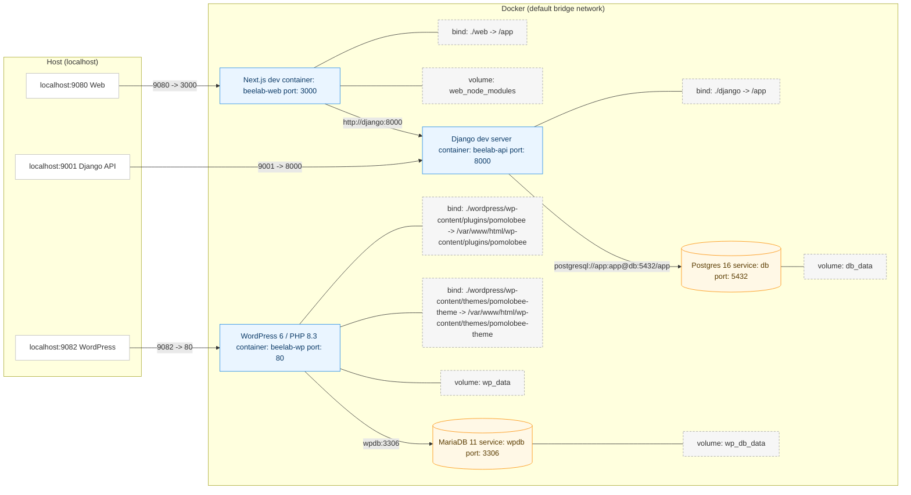

<a href="https://nathabee.github.io/beelab/index.html">
  
  
</a>


> [!WARNING]
> **Work in progress** — APIs, docs, and structure may change without notice.


[](#)


# BeeLab: Dockerized Multiservice (Django + Next.js plugins + WordPress + databases)


BeeLab provides a dockerized multi-service development stack:

* **Django 5** backend (REST API, JWT auth; apps: **UserCore**, **PomoloBeeCore**, **CompetenceCore**)
* **Next.js 14** frontend (calls Django)
* **PostgreSQL 16** for Django
* **WordPress 6 / PHP 8.3 (Apache)** with custom theme and plugins that interface with Django
* **MariaDB 11** for WordPress

Notes:

* “Competence” manages student development charts.
* “PomoloBee” helps farmers manage their orchards.


```mermaid
flowchart LR
  classDef svc fill:#eaf5ff,stroke:#1e88e5,color:#0b3a67;
  classDef db  fill:#fff8e6,stroke:#fb8c00,color:#5a3b00;
  classDef vol fill:#f6f6f6,stroke:#9e9e9e,stroke-dasharray:4 3,color:#333;
  classDef host fill:#ffffff,stroke:#bdbdbd,color:#333;

  subgraph Host["Host (localhost)"]
    direction TB
    H9080["localhost:9080 Web"]:::host
    H9001["localhost:9001 Django API"]:::host
    H9082["localhost:9082 WordPress"]:::host
  end

  subgraph Docker["Docker (default bridge network)"]
    direction LR

    Web["Next.js dev container: beelab-web port: 3000"]:::svc
    Django["Django dev server container: beelab-api port: 8000"]:::svc
    PG[("Postgres 16 service: db port: 5432")]:::db
    WP["WordPress 6 / PHP 8.3 container: beelab-wp port: 80"]:::svc
    WPDB[("MariaDB 11 service: wpdb port: 3306")]:::db

    Web -- "http://django:8000" --> Django
    Django -- "postgresql://app:app@db:5432/app" --> PG
    WP -- "wpdb:3306" --> WPDB

    Web --- VNM["volume: web_node_modules"]:::vol
    PG  --- VPG["volume: db_data"]:::vol
    WP  --- VWP["volume: wp_data"]:::vol
    WPDB --- VWPD["volume: wp_db_data"]:::vol

    Web --- BWEB["bind: ./web -> /app"]:::vol
    Django --- BDJ["bind: ./django -> /app"]:::vol
    WP --- BTH["bind: ./wordpress/wp-content/themes/pomolobee-theme -> /var/www/html/wp-content/themes/pomolobee-theme"]:::vol
    WP --- BPL["bind: ./wordpress/wp-content/plugins/pomolobee -> /var/www/html/wp-content/plugins/pomolobee"]:::vol
  end

  H9080 -->|"9080 -> 3000"| Web
  H9001 -->|"9001 -> 8000"| Django
  H9082 -->|"9082 -> 80"| WP
```
---

## Quickstart
---
For more information

Visit the github pages: <a href="https://nathabee.github.io/beelab/index.html"> 
  
</a>

---

<a href="https://github.com/nathabee/beelab/blob/main/docs/installation-vps.md" >
the detailled installation manual on a VPS is available on docs/installation-vps.md
</a>

After installation you have acess to :

Service URLs (prod) : Example with domain nathabee.de:

* Django API: `http://localhost:9001`  or `https://beelab-api.<your domain>`  (health: `/health`)
* Web (Next.js): `http://localhost:9080` or `https://beelab-web.<your domain>`
* WordPress: `http://localhost:9082` or `https://beelab-wp.<your domain>`
 
---


## TRY ME

After installing this repository on nathabee we get:
* WordPress Pomolobee plugin: [https://beelab-wp.nathabee.de/pomolobee](https://beelab-wp.nathabee.de/pomolobee)
* WordPress Competence plugin: [https://beelab-wp.nathabee.de/competence](https://beelab-wp.nathabee.de/competence)
* WordPress: [https://beelab-wp.nathabee.de](https://beelab-wp.nathabee.de)
* WordPress admin: [https://beelab-wp.nathabee.de/wp-admin](https://beelab-wp.nathabee.de/wp-admin)
* Django API: [https://beelab-api.nathabee.de/api](https://beelab-api.nathabee.de/api)
* Django Admin: [https://beelab-api.nathabee.de/admin](https://beelab-api.nathabee.de/admin)
* Django API health : [https://beelab-api.nathabee.de/health](https://beelab-api.nathabee.de/health)
* Swagger UI: [https://beelab-api.nathabee.de/api/docs/](https://beelab-api.nathabee.de/api/docs/)
* Download OpenAPI schema: [https://beelab-api.nathabee.de/api/schema/](https://beelab-api.nathabee.de/api/schema/)
* Next.js web: [https://beelab-web.nathabee.de](https://beelab-web.nathabee.de)
---

## Screenshots

### Pomolobee Plugin in WordPress
<a href="./docs/screenshot_pomolobee_plugin.png">
  
</a>

### Competence Plugin in WordPress
<a href="./docs/screenshot_competence_plugin.png">
  
</a>

---

## Exporting Site Editor changes back into the theme

If you customize **Appearance → Editor**:

* Use **… → Tools → Export** to download the ZIP.
* Copy `theme.json`, `templates/`, `parts/` into:

```
wordpress/wp-content/themes/pomolobee-theme/
```

* Commit to Git.

---

## WordPress plugins

### pomolobee

From `wordpress/plugin-src/pomolobee/`:

```bash
npm install
npm run build
```

Installation:

```bash
./build_zip.sh
./install_plugin.sh
```

Then in WP Admin ([https://beelab-wp.nathabee.de](https://beelab-wp.nathabee.de)):

* Go to **Plugins**, verify the plugin is present, and activate it.
* Go to **Settings → Competence Settings** to configure the API endpoint.
  In this dev stack, Django is at `https://beelab-api.nathabee.de/api`.

---

## Project structure

```text
beelab/
├─ compose.yaml
├─ .env
├─ django/                      # Django project (config + apps)
│  ├─ manage.py
│  ├─ config/
│  ├─ PomoloBeeCore/            # Orchard app
│  ├─ CompetenceCore/           # Student evaluation app
│  └─ UserCore/                 # Auth / user management
├─ web/                         # Next.js app (dev server)
│  ├─ app/
│  └─ package.json
├─ wordpress/
│  └─ wp-content/
│     ├─ themes/
│     │  └─ pomolobee-theme/    # theme.json, templates, assets, scripts
│     └─ plugins/
│        ├─ pomolobee/          # integrates Django PomoloBeeCore
│        └─ competence/         # integrates Django CompetenceCore
└─ (volumes managed by Docker)
   • db_data        (Postgres)
   • web_node_modules
   • wp_db_data     (MariaDB)
   • wp_data        (WordPress files)
   • media_data     (Django media)
```


---
 