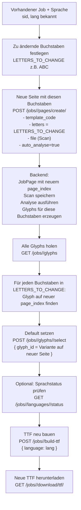

# WORKFLOW BEEFONT

## Überblick der Gesamtlogik des Font-Workflows

Das BeeFont-System folgt einem klar gegliederten Prozess:

1. **Der Benutzer legt ein Font-Projekt (Job) an.**
2. **Er erzeugt Seiten anhand definierter Templates.**
3. **Er lädt die ausgefüllten Vorlagen als Scan hoch – heute bevorzugt in einem Schritt per `create_page`.**
4. **Das Backend extrahiert daraus die einzelnen Glyphen.**
5. **Der Benutzer kontrolliert Varianten und wählt die bevorzugten Zeichen (Defaults).**
6. **Anschließend wird für eine gewünschte Sprache eine TTF-Datei erstellt.**

Daraus entstehen drei typische Szenarien:

* **Szenario A**: Einfache End-to-End-Erzeugung für eine Sprache (z.B. EN oder DE).
* **Szenario B**: Ein bestehender Job wird um eine zusätzliche Sprache erweitert (z.B. EN → FR).
* **Szenario C**: Einzelne Buchstaben eines bestehenden Fonts werden gezielt neu gezeichnet und ausgetauscht.

---
 

### Szenario A – Einfache End-to-End-Kette (eine Sprache)

```mermaid
flowchart TD
    A["Job anlegen\nPOST /jobs"] --> B["Job mit sid zurück"]
    B --> C["Alphabet + Templates laden\nGET /languages/&#123;lang&#125;/alphabet\nGET /templates"]
    C --> D["Alphabet in Seiten-Batches aufteilen\n(Kapazität Template z.B. 30)"]
    
    D --> E{"Nächster Batch\nnoch Zeichen übrig?"}
    E -- ja --> F["create_page\nPOST /jobs/&#123;sid&#125;/pages/create/\n- template_code\n- letters (Batch)\n- file (Scan)\n- auto_analyse=true"]
    F --> G["Backend:\nJobPage anlegen\npage_index auto\nScan speichern\nAnalyse ausführen\nGlyphs erzeugen"]
    G --> H["Optional: Glyph-Varianten prüfen\nGET /jobs/&#123;sid&#125;/glyphs/LETTER\nPOST /jobs/&#123;sid&#125;/glyphs/&#123;letter&#125;/select"]
    H --> I["Sprachstatus prüfen\nGET /jobs/&#123;sid&#125;/languages/&#123;lang&#125;/status"]
    I --> J{"ready == true?"}
    
    J -- nein --> E
    J -- ja --> K["TTF bauen\nPOST /jobs/&#123;sid&#125;/build-ttf\nPayload: language = lang"]
    K --> L["FontBuild + .ttf erzeugen"]
    L --> M["TTF herunterladen\nGET /jobs/&#123;sid&#125;/download/ttf/&#123;lang&#125;"]
    E -- nein --> X["Fehler: Alphabet nicht vollständig\noder Logik prüfen"]

```



---

### Szenario B – Bestehender Job, zusätzliche Sprache ergänzen

```mermaid
flowchart TD 
    A["Vorhandener Job\nsid bekannt"]
        --> B["Sprachstatus für neue Sprache\nGET /jobs/&#123;sid&#125;/languages/&#123;lang_new&#125;/status"]
    B --> C{"ready == true?"}

    C -- ja --> D["Optional: sofort TTF bauen\nPOST /jobs/&#123;sid&#125;/build-ttf\n{ language: lang_new }\nGET /jobs/&#123;sid&#125;/download/ttf/&#123;lang_new&#125;"]
    C -- nein --> E["missing_chars aus Status lesen\nz.B. ÉÈÊ..."]

    E --> F["Seite mit fehlenden Zeichen anlegen\nPOST /jobs/&#123;sid&#125;/pages/create/\n- template_code\n- letters = missing_chars\n- file (Scan)\n- auto_analyse=true"]
    F --> G["Backend:\nJobPage + Scan + Analyse\nGlyphs für fehlende Zeichen erzeugen"]
    G --> H["Optional: Varianten sichten\nGET /jobs/&#123;sid&#125;/glyphs/LETTER\nPOST /jobs/&#123;sid&#125;/glyphs/&#123;letter&#125;/select"]
    H --> I["Sprachstatus erneut prüfen\nGET /jobs/&#123;sid&#125;/languages/&#123;lang_new&#125;/status"]
    I --> J{"ready == true?"}

    J -- nein --> E
    J -- ja --> K["TTF bauen\nPOST /jobs/&#123;sid&#125;/build-ttf\n{ language: lang_new }"]
    K --> L["TTF herunterladen\nGET /jobs/&#123;sid&#125;/download/ttf/&#123;lang_new&#125;"]
    L --> M["Optional: Gesamtpaket\nGET /jobs/&#123;sid&#125;/download/zip"]

```



---

### Szenario C – Gezieltes Redesign einzelner Buchstaben


 

---

## 1. Szenario A – Einfache End-to-End-Kette für eine Sprache

Typischer Fall: Du möchtest **für genau eine Sprache** (z.B. EN oder DE) einen kompletten Font bauen.

Technisch:

* Sprache kommt aus `SupportedLanguage` (z.B. `de`).
* Alphabet der Sprache kommt aus `/languages/<code>/alphabet`.
* Ein Template wie `A4_6x5` hat 30 Slots pro Seite.
* Die Seiten werden heute bevorzugt über **einen einzigen Endpoint** angelegt:

  ```http
  POST /api/beefont/jobs/<sid>/pages/create_page
  ```

  mit:

  * `template_code`
  * `letters`
  * `file` (Scan)
  * optional `auto_analyse=true` (direkt segmentieren)

### 1.1. CLI-Testlauf (Beispiel)

Mit den Shell-Aliases:

```bash
# Einfacher End-to-End-Test für DE:
beefont_demo_scenarioA myfont de
```

Dieser Befehl macht im Prinzip:

* Job anlegen,
* Alphabet für `de` holen,
* Template-Bilder als Fake-Scans erzeugen,
* pro Seite `create_page` + auto Analyse,
* solange wiederholen, bis `ready=true`,
* TTF bauen und herunterladen.

### 1.2. Ablauf im Detail

1. **Job anlegen**

   ```http
   POST /api/beefont/jobs
   {
     "name": "myfont",
     "base_family": "myfont"
   }
   ```

   Antwort enthält u.a.:

   ```json
   {
     "sid": "72afeb45120349d4bd73c2f1de5c7d57",
     ...
   }
   ```

2. **Alphabet + Template laden**

   ```http
   GET /api/beefont/languages
   GET /api/beefont/languages/de/alphabet
   GET /api/beefont/templates
   ```

   Das Frontend kennt jetzt: 

   * den Sprachcode (`de`),
   * das Alphabet,
   * die Template-Kapazität (z.B. 30 Zeichen pro Seite bei `A4_6x5`).

3. **Alphabet in Seiten aufteilen**

   Das Frontend teilt das Alphabet in Blöcke à 30 Zeichen (oder weniger für die letzte Seite).

   In der CLI passiert das im Loop innerhalb von `beefont_demo_scenarioA` als `BATCH`.

4. **Seiten anlegen + Scan hochladen + Analyse – heute bevorzugt per `create_page`**

   Statt:

   * `POST /jobs/<sid>/pages`
   * `POST /jobs/<sid>/pages/<page_id>/upload-scan`
   * `POST /jobs/<sid>/pages/<page_id>/analyse`

   wird nun in der Regel **alles in einem Schritt** gemacht:

   ```http
   POST /api/beefont/jobs/<sid>/pages/create_page
   Content-Type: multipart/form-data

   template_code = A4_6x5
   letters       = ABCDE...
   file          = <Scan PNG/JPEG>
   auto_analyse  = true
   ```

   Verhalten:

   * Wenn `page_index` **weggelassen** wird, vergibt das Backend automatisch den nächsten freien Index (`0, 1, 2, ...`).
   * `JobPage` wird angelegt,
   * der Scan wird gespeichert,
   * bei `auto_analyse=true` wird sofort `_run_page_analysis` aufgerufen,
   * alle Glyphs für diese Seite werden erzeugt,
   * `analysed_at` wird gesetzt.

   Rückgabe-Struktur:

   ```json
   {
     "page": { ...JobPageSerializer... },
     "analysis": {
       "detail": "Analyse abgeschlossen.",
       "glyph_variants_created": 30
     }
   }
   ```

5. **Glyphs prüfen und Default je Buchstabe setzen**

   ```http
   # alle Glyphs:
   GET /api/beefont/jobs/<sid>/glyphs

   # Variants für einen Buchstaben:
   GET /api/beefont/jobs/<sid>/glyphs/A

   # Default setzen:
   POST /api/beefont/jobs/<sid>/glyphs/A/select
   {
     "glyph_id": 42
   }
   ```

6. **Sprachstatus prüfen**

   ```http
   GET /api/beefont/jobs/<sid>/languages/de/status
   ```

   Beispiel:

   ```json
   {
     "language": "de",
     "ready": true,
     "required_chars": "ABCDEFGHIJKLMNOPQRSTUVWXYZÄÖÜßabcdefghijklmnopqrstuvwxyzäöüß0123456789",
     "missing_chars": "",
     "missing_count": 0
   }
   ```

7. **TTF bauen und herunterladen**

   ```http
   POST /api/beefont/jobs/<sid>/build-ttf
   {
     "language": "de"
   }

   GET /api/beefont/jobs/<sid>/download/ttf/de
   ```

---

## 2. Szenario B – Bestehender Job, zusätzliche Sprache ergänzen

Hier gibt es bereits einen Job (z.B. EN ist fertig), und du möchtest für **denselben Job** eine weitere Sprache ergänzen, z.B. FR.

### 2.1. CLI-Testlauf (konkretes Beispiel)

Du hast einen existierenden Job mit:

```text
SID = f44546c11d9248a382a92c86e0e5bc23
```

Dann:

```bash
# (2344 war ein Tippfehler ohne Leerzeichen nach dem Funktionsnamen)

# 2345 – korrekt:
beefont_demo_scenarioB f44546c11d9248a382a92c86e0e5bc23 fr
```

Dieser Aufruf macht im Prinzip:

* Sprachstatus für `fr` holen,
* fehlende Zeichen ermitteln (`missing_chars`),
* eine Seite mit diesen Zeichen anlegen,
* Template-Bild als Fake-Scan erzeugen,
* Scan hochladen, analysieren,
* TTF für die neue Sprache bauen.

### 2.2. Ablauf im Detail

1. **Ausgangslage**

   * Job mit `sid = f44546c11d9248a382a92c86e0e5bc23` existiert.
   * Eine Sprache (z.B. EN oder DE) ist bereits fertig.
   * Du möchtest `fr` ergänzen.

2. **Status für neue Sprache prüfen**

   ```http
   GET /api/beefont/jobs/<sid>/languages/fr/status
   ```

   Beispiel:

   ```json
   {
     "language": "fr",
     "ready": false,
     "required_chars": "ABCDEFGHIJKLMNOPQRSTUVWXYZÀÂÇÉÈÊËÎÏÔÙÛÜŸ...",
     "missing_chars": "ÉÈÊ",
     "missing_count": 3
   }
   ```

3. **Fehlende Zeichen auf Seiten bringen**

   Im idealen Flow machst du auch hier **create_page**:

   ```http
   POST /api/beefont/jobs/<sid>/pages/create_page
   template_code = A4_6x5
   letters       = ÉÈÊ
   file          = <Scan mit diesen Zeichen>
   auto_analyse  = true
   ```

   Das CLI-Szenario B benutzt intern noch die getrennten Schritte
   (`beefont_job_page_create`, `beefont_page_upload_scan`, `beefont_page_analyse`),
   aber logisch ist es identisch: **eine Seite mit `missing_chars` anlegen und analysieren**.

4. **Varianten prüfen und Default setzen (falls nötig)**

   ```http
   GET /api/beefont/jobs/<sid>/glyphs/É
   POST /api/beefont/jobs/<sid>/glyphs/É/select { "glyph_id": 77 }
   ```

5. **Status erneut prüfen**

   ```http
   GET /api/beefont/jobs/<sid>/languages/fr/status
   ```

   Ziel:

   ```json
   {
     "language": "fr",
     "ready": true,
     "missing_chars": "",
     "missing_count": 0
   }
   ```

6. **TTF bauen und ggf. ZIP exportieren**

   ```http
   POST /api/beefont/jobs/<sid>/build-ttf
   { "language": "fr" }

   GET /api/beefont/jobs/<sid>/download/ttf/fr
   GET /api/beefont/jobs/<sid>/download/zip
   ```

---

## 3. Szenario C – Gezieltes Redesign einzelner Buchstaben

Hier ist der Job grundsätzlich fertig, aber du möchtest **einzelne Buchstaben** neu zeichnen und als Default setzen, z.B. ein „A“, „B“, „C“ in einer bestimmten Sprache.

### 3.1. CLI-Testlauf (konkretes Beispiel)

Mit demselben Job wie oben:

```bash
# 2346 – „ABC“ für EN neu zeichnen
beefont_demo_scenarioC f44546c11d9248a382a92c86e0e5bc23 en A4_6x5 ABC
```

Dieser Befehl macht im Kern:

* eine neue Seite mit den Buchstaben `A`, `B`, `C`,
* Template-Bild als Fake-Scan,
* Scan hochladen und analysieren,
* für `A`, `B`, `C` die Glyphs auf dieser neuen Seite suchen,
* diese Varianten per API als neue Defaults setzen,
* TTF für `en` neu bauen und herunterladen.

### 3.2. Ablauf im Detail

1. **Ausgangslage**

   * Job mit `sid = f44546c11d9248a382a92c86e0e5bc23`.
   * Sprache `en` ist bereits voll abgedeckt.
   * Du möchtest `LETTERS_TO_CHANGE = "ABC"` neu zeichnen.

2. **Neue Seite nur mit den zu ändernden Buchstaben**

   Modern/preferiert wieder per `create_page`:

   ```http
   POST /api/beefont/jobs/<sid>/pages/create_page
   template_code = A4_6x5
   letters       = ABC
   file          = <Scan mit neu gezeichnetem A,B,C>
   auto_analyse  = true
   ```

   Antwort enthält:

   ```json
   {
     "page": {
       "id": 123,
       "page_index": 4,
       ...
     },
     "analysis": {
       "detail": "Analyse abgeschlossen.",
       "glyph_variants_created": 3
     }
   }
   ```

   Der `page_index` ist wichtig, um die neuen Varianten wiederzufinden.

3. **Neue Glyphs für diese Seite finden**

   ```http
   GET /api/beefont/jobs/<sid>/glyphs
   ```

   Dann pro Buchstabe:

   * alle Glyphs mit `letter = 'A'` und `page_index = <neue Seite>` herausfiltern,
   * deren `id` übernehmen.

   In der CLI macht `beefont_demo_scenarioC` genau das mit `jq` und `page_index`.

4. **Neue Varianten als Default setzen**

   ```http
   POST /api/beefont/jobs/<sid>/glyphs/A/select
   { "glyph_id": <id von A auf der neuen Seite> }

   POST /api/beefont/jobs/<sid>/glyphs/B/select
   { "glyph_id": <id von B auf der neuen Seite> }

   POST /api/beefont/jobs/<sid>/glyphs/C/select
   { "glyph_id": <id von C auf der neuen Seite> }
   ```

   Die API sorgt dafür, dass pro Buchstabe genau eine Default-Variante (`is_default=true`) existiert.

5. **Sprachstatus und TTF neu bauen**

   Du kannst optional den Status prüfen:

   ```http
   GET /api/beefont/jobs/<sid>/languages/en/status
   ```

   und dann die TTF neu bauen:

   ```http
   POST /api/beefont/jobs/<sid>/build-ttf
   { "language": "en" }

   GET /api/beefont/jobs/<sid>/download/ttf/en
   ```

---

## 4. Endpunkte – „Empfohlen“ vs. „Low Level“

Zusammenfassung der relevanten Endpunkte nach der Umstellung:

### Empfohlene High-Level-Endpunkte

* **Jobverwaltung**

  * `GET /jobs`
  * `POST /jobs`
  * `GET /jobs/<sid>`
  * `DELETE /jobs/<sid>`

* **Seiten + Scan in einem Schritt**

  * `POST /jobs/<sid>/pages/create_page`
    → heute der Standardweg:

    * optionaler `page_index` (sonst auto),
    * `template_code`,
    * `letters`,
    * `file`,
    * optional `auto_analyse`.

* **Glyphs**

  * `GET /jobs/<sid>/glyphs`
  * `GET /jobs/<sid>/glyphs/<letter>`
  * `POST /jobs/<sid>/glyphs/<letter>/select`

* **Sprachen & Alphabet**

  * `GET /languages`
  * `GET /languages/<code>/alphabet`
  * `GET /jobs/<sid>/languages/status`
  * `GET /jobs/<sid>/languages/<code>/status`

* **Build & Download**

  * `POST /jobs/<sid>/build-ttf`
  * `GET /jobs/<sid>/download/ttf/<language>`
  * `GET /jobs/<sid>/download/zip`

### Low-Level (noch vorhanden, aber für UI nicht mehr nötig)

* `POST /jobs/<sid>/pages/<page_id>/upload-scan`
* `POST /jobs/<sid>/pages/<page_id>/analyse`
* `POST /jobs/<sid>/pages/<page_id>/retry-analysis`

Diese Endpunkte bleiben für Spezialfälle und Debugging interessant, aber für den regulären User-Flow sind **Szenario A/B/C komplett mit `create_page` und den Build/Status-Endpunkten abdeckbar.**

--- 
