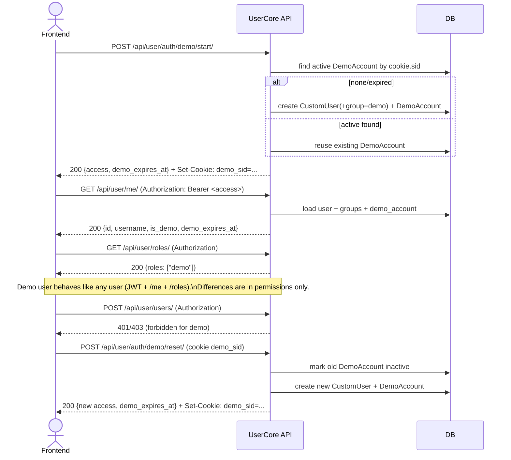

# Workflow test with Django Pytest

## Demo User login (UserCore)

### Diagramm

---

# Frontend flows

only have **one** user model in the DB: `CustomUser`.
“Demo” is **not** a separate user type; it’s just:

* a normal `CustomUser` placed in the **demo** group, and
* a linked `DemoAccount` row that holds the cookie `sid`, expiry, and active flag.

So the frontend can treat demo users exactly like any other logged-in user (same `/api/user/me`, same `/api/user/roles`, same `Authorization: Bearer …`). The only extra bit is how you **create** the account (the “Demo” button) and how you optionally **discard** it. Here’s the exact flow.

#### 1) Start demo (the “Demo” button)

1. `POST /api/user/auth/demo/start/`
2. Server returns JSON `{ "access": "<JWT>", ... }` **and** sets `demo_sid` as an **HttpOnly cookie**.
3. Frontend stores the JWT (e.g. in memory) and sets `Authorization: Bearer <JWT>` for future calls.

Now you can call:

* `GET /api/user/me` → you’ll see `is_demo: true` and `demo_expires_at`.
* `GET /api/user/roles` → will include `"demo"`.

> You do **not** manage `demo_sid` from JS (it’s HttpOnly); the server reuses it to keep the same demo account until it expires or you reset it.

#### 2) Use app like a normal user

* Everything works the same as a regular user. Permissions are enforced by groups/permissions; your code also exposes `is_demo` and `demo_expires_at` on `/me` for convenience.
* JWT contains `role: "demo"` and `demo_exp` (epoch). That’s just extra context—auth still works the same.

#### 3) “Reset demo” (get a fresh clean account)

1. Client sends `POST /api/user/auth/demo/reset/` (no body, the cookie identifies which demo to invalidate).
2. Server marks the **current** DemoAccount inactive, creates a **new** `CustomUser` in the **demo** group, issues a **new** `DemoAccount` + JWT, and **overwrites** the `demo_sid` cookie.
3. Frontend replaces its in-memory token with the new `access`.

This is your “wipe and start over” action.

#### 4) Logout only (keep same demo for later)

* Just drop the JWT on the client (clear your app’s auth state).
* Don’t touch cookies — the HttpOnly `demo_sid` remains.
  Next time the user clicks “Demo” (start), the server **reuses** the same demo account until it expires (30 days) or you reset.

#### 5) End demo *immediately* (optional UX)

If you want a “Stop demo” button that prevents reuse:

* Call `POST /api/user/auth/demo/reset/` and simply **ignore** the response JWT on the frontend (i.e., don’t adopt the new account), then clear your app’s auth state. The previously active demo is now invalidated, so it won’t be reused.
* (If you later want a dedicated “logout & clear cookie” endpoint, you can add one that sets `demo_sid` with `max_age=0`. Not required for your current tests.)

---

### Integration Test

available in UserCore/tests/test_demo_integration_flow.py
