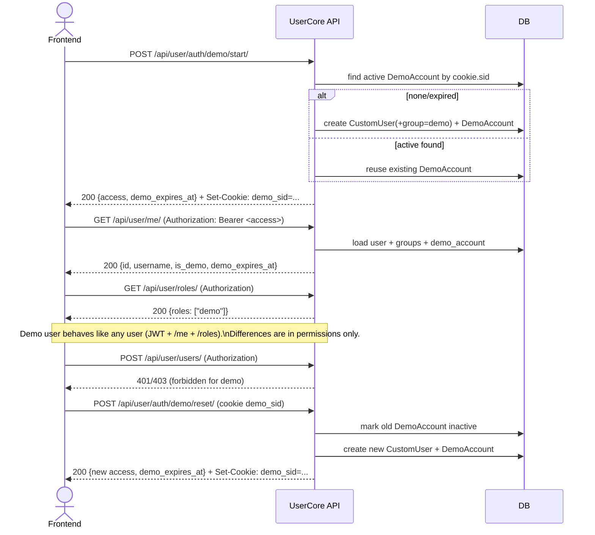

# Workflow test with Django Pytest

## User login (UserCore)

### Diagramm

```mermaid
sequenceDiagram
    actor FE as Frontend
    participant API as UserCore API
    participant DB as DB

    FE->>API: POST /api/user/auth/demo/start/
    API->>DB: find active DemoAccount by cookie.sid
    alt none/expired
        API->>DB: create CustomUser(+group=demo) + DemoAccount
    else active found
        API->>DB: reuse existing DemoAccount
    end
    API-->>FE: 200 {access, demo_expires_at} + Set-Cookie: demo_sid=...

    FE->>API: GET /api/user/me/ (Authorization: Bearer <access>)
    API->>DB: load user + groups + demo_account
    API-->>FE: 200 {id, username, is_demo, demo_expires_at}

    FE->>API: GET /api/user/roles/ (Authorization)
    API-->>FE: 200 {roles: ["demo"]}

    note over FE,API: Demo user behaves like any user (JWT + /me + /roles).\nDifferences are in permissions only.

    FE->>API: POST /api/user/users/ (Authorization)
    API-->>FE: 401/403 (forbidden for demo)

    FE->>API: POST /api/user/auth/demo/reset/ (cookie demo_sid)
    API->>DB: mark old DemoAccount inactive
    API->>DB: create new CustomUser + DemoAccount
    API-->>FE: 200 {new access, demo_expires_at} + Set-Cookie: demo_sid=...

```

### Integration Test

available in UserCore/tests/test_demo_integration_flow.py