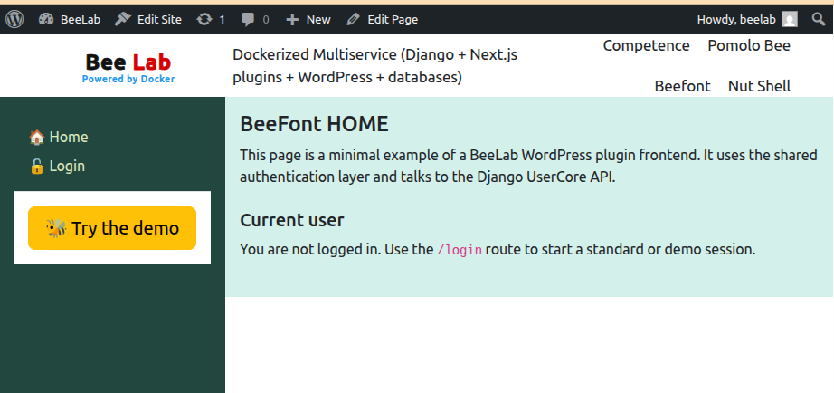
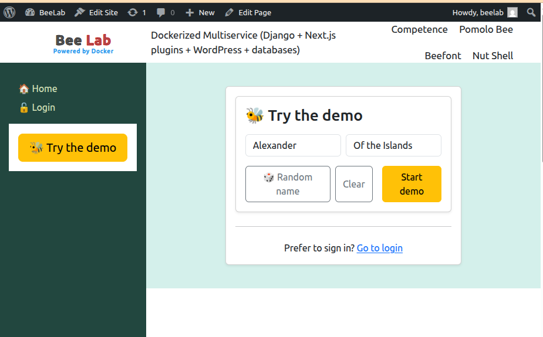
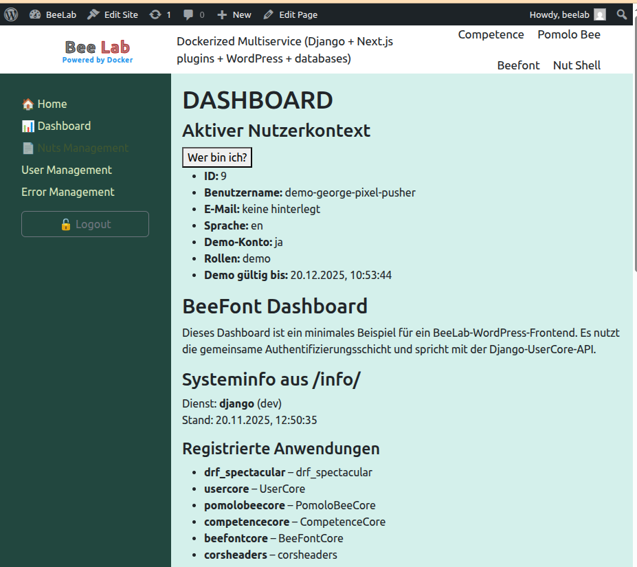

# WordPress Developer Guide: Overview for BeeLab Plugins

This document provides a high-level overview of how our custom WordPress plugins are structured, built, and maintained.
It also explains how to duplicate the **Nutshell** starter plugin to create a new application, such as **BeeFont**.

---

## Plugin Creation

### 1. Duplicate from Nutshell

To create a new plugin, start by duplicating the existing **Nutshell** plugin:

```bash
cd wordpress/plugin-src/
mkdir <pluginName>
cd <pluginName>

cp -Rp ../nutshell/* ./        # copy all files
chmod +x rename-app.sh         # enable the renaming script
```

Run the renaming script:

```bash
./rename-app.sh
Enter new app name in CamelCase (e.g. MyNewApp): MyNewApp
Using replacements:
  Nutshell  -> MyNewApp
  NUTSHELL  -> MYNEWAPP
  nutshell  -> mynewapp
Continue? [y/N] y
Replacing strings inside files...
Renaming files and directories...
Done.
```

This replaces all occurrences of **Nutshell** in:

* filenames
* directory names (including `src/nutshell-app`)
* file contents (JavaScript, PHP, JSON, TypeScript, README, etc.)

### 2. Build the new plugin

```bash
npm install
npm run build
```

This produces a WordPress-ready ZIP file in:

```
../build/<pluginName>.zip
```

---

## Install and Activate the Plugin

Start WordPress and upload the newly built plugin.

In the BeeLab development environment, WordPress is available at:

```
http://localhost:9082/wp-admin
```

Steps:

1. Go to *Plugins* → *Add New* → *Upload Plugin*
2. Select the ZIP file from `build/`
3. Install and activate it

In the WordPress admin menu, a new settings section `<MyNewApp>` appears.
There you can configure the Django backend URL if needed:

```
http://localhost:9001/api
```

### Add a navigation link (if needed)

In the theme header or navigation block:

```html
<!-- wp:navigation-link {"label":"MyNewApp","url":"/mynewapp","kind":"custom"} /-->
```

You can now access the plugin under:

```
http://localhost:9082/mynewapp
```

---

## Screenshots (from Nutshell reference plugin)

**Home** – Public screen, shows data accessible without login <a href="./plugin-nutshell-home.png">  </a>

**Demo User** – Creates a demo user <a href="./plugin-nutshell-demouser.png">  </a>

**Dashboard** – Authenticated view <a href="./plugin-nutshell-dashboard.png">  </a>

---

## Capabilities of the Nutshell Plugin

Nutshell serves as the **frontend template** for all BeeLab WordPress plugins:

* React application integrated into WordPress
* Communication with our Django REST API (UserCore and other apps)
* Shared authentication layer (JWT)
* Shared error handling and API utilities
* Ready-to-duplicate structure for new apps

---

## Code Structure

The code for each plugin is located at:

```
plugin-src/<myappname>/src
```

Directory overview:

```
app/         Router, header, main layout
assets/      Images and static resources
<appname>-app/  WordPress block integration files
components/  Reusable UI components
context/     React context (global state)
hooks/       API calls and data fetching logic
mytypes/     Type definitions aligned with Django serializers
pages/       Page components referenced in the router
utils/       General utilities
```

The plugin entrypoint configuration is located in:

```
plugin-src/<myappname>/<myappname>.php
```

Shared utilities used by all plugins are in:

```
plugin-src/shared/
```

---

## Development Method

Each frontend plugin corresponds to a backend module.
This requires alignment of:

* API endpoints (`django/<app>/urls.py`)
* Serializers and data models (`django/<app>/serializers.py`)
* Frontend types (`plugin-src/<app>/src/mytypes/...`)
* Workflow and screens defined in the specification

### Steps to implement a new plugin

1. **Duplicate Nutshell** into `plugin-src/<myappname>`
2. **Rename** it using `rename-app.sh`
3. **Define the required pages** in your functional specification
4. **Add routes** in:

   * `app/router.ts`
   * `app/Header.ts` (if needed)
   * WordPress plugin config (`<myappname>.php`)
5. **Create page components** under `pages/`
6. **Define TypeScript types** according to Django serializers
7. **Implement API hooks** aligned with Django URLs
8. **Integrate components** and write the workflow logic
9. **Build**, install, and test in the WordPress environment

---
 