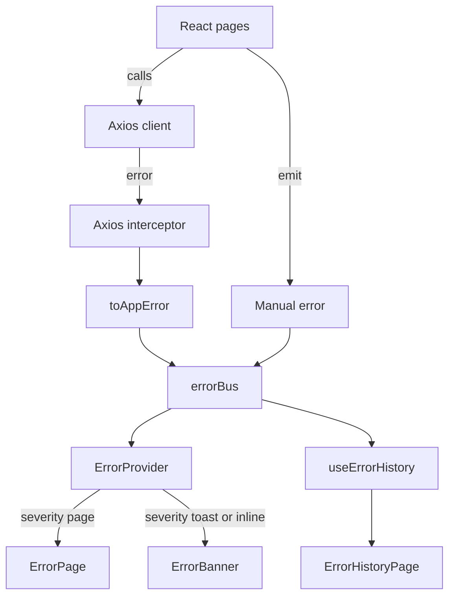

# WordPress Plugin Developer Guide: Using the Shared Error Library

This guide explains how to integrate the **shared React error system** (`@bee/common/error`) into any WordPress React plugin (e.g. Pomolobee).
It covers architecture, setup, usage, and expected behaviors.

---



---


## 1. What the shared error system is

The shared error library provides:

* **Global error bus**: singleton event emitter for app errors.
* **Error context & provider**: collects errors, exposes the latest one, redirects on “page-level” problems.
* **Error boundary**: catches unexpected render errors and forwards them.
* **UI helpers**:

  * `ErrorBanner`: slim alert for non-blocking errors.
  * `ErrorPage`: full-page error view (blocking).
  * `ErrorHistoryPage`: shows a table of all past errors.
  * `ErrorTestButtons`: buttons to simulate errors (dev only).
* **Utilities**:

  * `toAppError(error, ctx?)`: normalize unknown/Axios errors into `AppError`.
  * `friendlyMessage(error)`: map status codes to user-friendly text.
  * `useErrorHistory`: hook for recorded errors.
* **Types**:

  * `AppError` and helpers.

---


## 2. Setup in a plugin

### 2.1. Webpack alias

📌 **File:** `plugin-src/pomolobee/webpack.config.js`

```js
alias: {
  '@bee/common': path.resolve(__dirname, '../shared/error'),
  '@context': path.resolve(__dirname, 'src/context'),
  '@utils': path.resolve(__dirname, 'src/utils'),
  // ...other aliases
}
```

---

### 2.2. Localize settings from PHP

📌 **File:** `plugin-src/pomolobee/pomolobee.php` (or your main plugin bootstrap file)

```php
add_action('enqueue_block_assets', function () {
    $handle = 'pomolobee-pomolobee-app-view';
    $api_url = get_option('pomolobee_api_url', 'http://localhost:9001/api');

    wp_localize_script($handle, 'pomolobeeSettings', [
        'apiUrl'    => $api_url,
        'basename'  => '',                  // Router base
        'errorPath' => '/pomolobee_error',  // Route to show on page-level errors
    ]);
});
```

---

### 2.3. Router integration

📌 **File:** `plugin-src/pomolobee/src/app/router.tsx`

```tsx
<Route path="/pomolobee_error" element={<ErrorPage plugin="pomolobee" />} />
```

---

### 2.4. Wrap your app

📌 **File:** `plugin-src/pomolobee/src/app/App.tsx`

```tsx
<BrowserRouter basename={(window as any).pomolobeeSettings?.basename || '/'}>
  <ErrorProvider errorPath={(window as any).pomolobeeSettings?.errorPath || '/pomolobee_error'}>
    <ErrorBanner />
    <ErrorBoundary>
      <AppRoutes />
    </ErrorBoundary>
  </ErrorProvider>
</BrowserRouter>
```

---

## 3. Emitting errors

### 3.1. From Axios clients

📌 **File:** `plugin-src/pomolobee/src/utils/api.ts`

```ts
export const apiUser = createAxiosClient({
  baseUrl: BASE,
  basePath: '/user',
  service: 'user',
  meta: { plugin: 'pomolobee' },
});
```

---

### 3.2. Manual errors

📌 **Where:** in any React component or service function that may emit errors.

```ts
const err = toAppError(new Error('Something broke'), {
  code: 'MANUAL',
  severity: 'toast',
  category: 'ui',
  service: 'ui',
  functionName: 'onClick',
  meta: { plugin: 'pomolobee' },
});
errorBus.emit(err);
```

---


## 4. Severity levels

* `page` → critical, redirect to **ErrorPage**.
* `toast` → recoverable, show toast/alert via **ErrorBanner**.
* `inline` → local component error, handled where it happens.

**Defaults:**

* 404 from API → `page` severity → redirect.
* Timeout → `toast` severity → stay on page.
* Manual example → you choose.

---


## 5. Components you can use

📌 **Where:** in your app’s layout and routes.

* `<ErrorBanner />` → in `App.tsx` layout
* `<ErrorPage plugin="pomolobee" />` → in router
* `<ErrorHistoryPage plugin="pomolobee" />` → in debug page
* `<ErrorTestButtons apiApp={apiApp} apiUser={apiUser} plugin="pomolobee" />` → in debug page

---

## 6. Example: Error management page

📌 **File:** `plugin-src/pomolobee/src/pages/PomolobeeErrorMgt.tsx`

```tsx
import { ErrorTestButtons, ErrorPage, ErrorHistoryPage } from '@bee/common';
import { apiApp, apiUser } from '@utils/api';

export default function PomolobeeErrorMgt() {
  return (
    <>
      <h2>Debug: test some errors</h2>
      <ErrorTestButtons apiApp={apiApp} apiUser={apiUser} plugin="pomolobee" />

      <h3>Active error display</h3>
      <ErrorPage plugin="pomolobee" />

      <h3>Error history</h3>
      <ErrorHistoryPage plugin="pomolobee" />
    </>
  );
}
```

---

## 7. API reference (quick)

```ts
import {
  ErrorProvider,
  ErrorBoundary,
  ErrorBanner,
  ErrorPage,
  ErrorHistoryPage,
  ErrorTestButtons,
  errorBus,
  toAppError,
  friendlyMessage,
  useErrorHistory,
  clearAllErrors,
} from '@bee/common';
```

---

## 8. Expected behaviors

* **404** → normalized to `page` severity → redirects to ErrorPage.
* **Timeout** → normalized to `toast` severity → shown inline.
* **Manual error** → severity depends on what you set.
* **All errors** → appear in ErrorHistoryPage if tagged with `meta.plugin`.

--- 

## 9. Best practices

* 📌 Add `<ErrorBanner />` in your **layout** (App.tsx).
* 📌 Add `<ErrorPage />` in your **router**.
* 📌 Add `<ErrorHistoryPage />` in a **debug/admin-only page**.
* 📌 Add `meta.plugin` in **api.ts** and manual errors.

---

 