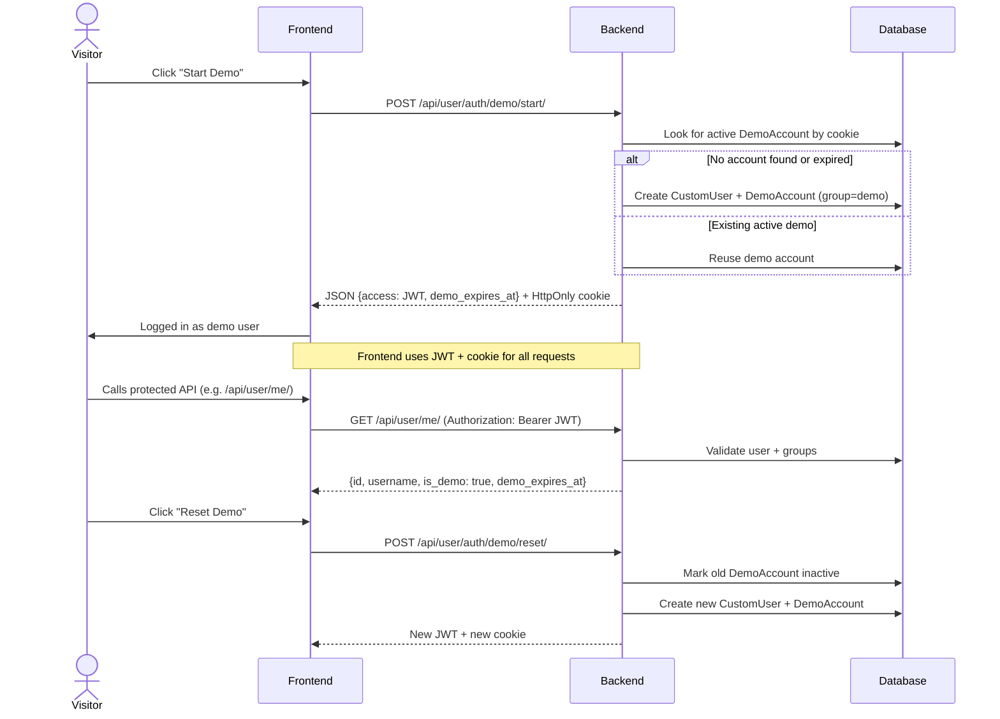

# 🐝 Demo User Solution

This project supports **Demo Users**: temporary accounts that let visitors explore the system without registering.

---

## 🔑 Key Concepts

* **Single user model**
  Demo users are standard `CustomUser` records in the database.

  * They belong to the **`demo` group**.
  * They have a linked `DemoAccount` row that stores:

    * `sid` (secure identifier, stored in a cookie)
    * `expires_at` (typically 30 days)
    * `active` flag

* **No separate model**
  There is **no** `DemoUser` model. The demo user is handled by the same logic as real users, with group + expiry.

* **Same API**
  Frontend and backend treat demo users just like regular users:

  * `/api/user/me/` → full user info with `is_demo` and `demo_expires_at`
  * `/api/user/roles/` → includes `"demo"` if user is a demo

---

## 🚀 API Endpoints

| Endpoint                     | Method | Purpose                                                              |
| ---------------------------- | ------ | -------------------------------------------------------------------- |
| `/api/user/auth/demo/start/` | POST   | Start or reuse a demo session. Returns JWT + sets `demo_sid` cookie. |
| `/api/user/auth/demo/reset/` | POST   | End current demo, create a new one, issue fresh JWT + cookie.        |
| `/api/user/me/`              | GET    | Info about current user (works for demo + normal users).             |
| `/api/user/roles/`           | GET    | List of roles (groups) the user belongs to.                          |

---

## 🖥️ Frontend Workflow


### Diagram




### 1. Start demo session

* User clicks **“Start Demo”**.
* Frontend calls `POST /api/user/auth/demo/start/`.
* Server responds:

  * JSON with `{"access": "<JWT>", "demo_expires_at": "..."}`
  * HttpOnly cookie `demo_sid` is set automatically.

Frontend:

* Stores the `access` JWT (e.g. in memory, Redux, etc.).
* Adds `Authorization: Bearer <JWT>` for all further API calls.

### 2. Use as normal user

* `/api/user/me/` → shows demo flag + expiry date.
* `/api/user/roles/` → includes `"demo"`.
* Frontend logic is identical to real users.

### 3. Reset demo

* User clicks **“Reset Demo”**.
* Frontend calls `POST /api/user/auth/demo/reset/`.
* Server:

  * Invalidates old demo account.
  * Creates a fresh `CustomUser` in `demo` group.
  * Returns new JWT + sets new `demo_sid` cookie.

### 4. Logout

* Just clear the JWT in frontend.
* Cookie remains; if user clicks “Demo” again, backend reuses the existing demo account.

---

## 🧹 Cleanup Daemon

Demo accounts are temporary. Expired or inactive accounts are cleaned up.

* Management command:

  ```bash
  python manage.py cleanup_demo
  ```

* This removes expired `DemoAccount` rows and their linked `CustomUser`.

* Can be scheduled with **cron** or a **Docker sidecar service** running hourly.

---

## ✅ Advantages

* **Simple:** one unified `CustomUser` model.
* **Consistent:** frontend uses same API flow as normal users.
* **Safe:** demo accounts expire automatically.
* **Clean:** daemon removes old demo accounts.

--- 

